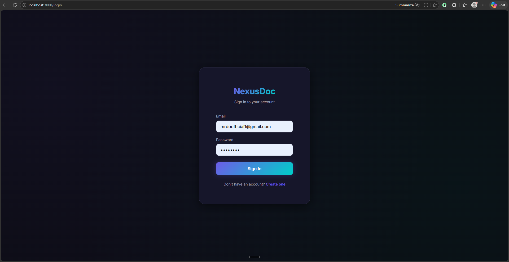
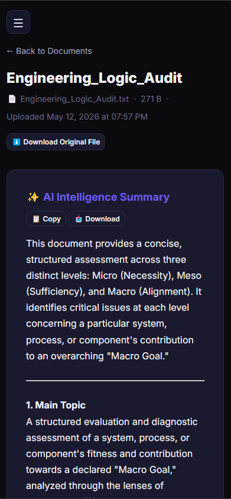
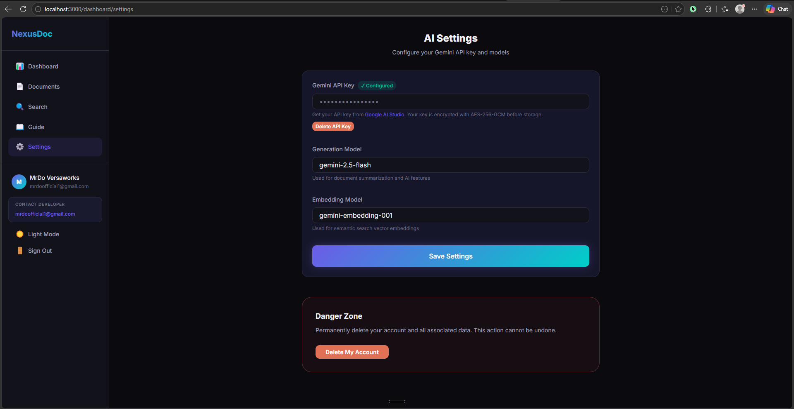
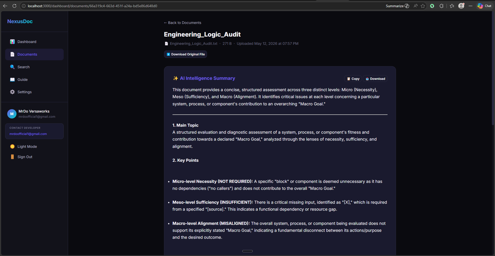
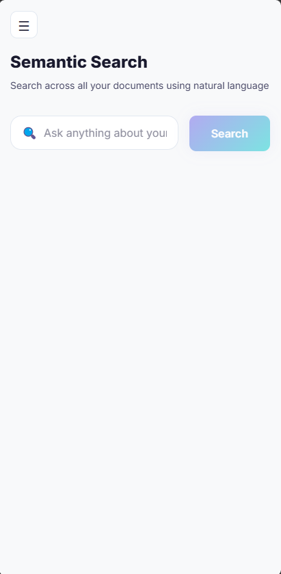
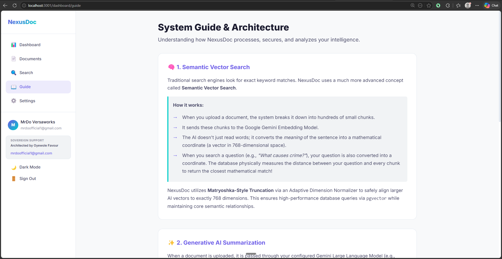

# NexusDoc — AI Document Intelligence Platform

[](https://github.com/MrDoVersaworks/nexusdoc/actions)
[](https://playwright.dev/)
[](https://opensource.org/licenses/MIT)

**NexusDoc** is a production-grade Document Intelligence platform that leverages the Gemini AI engine to provide semantic search, automated summarization, and vector-based extraction for PDFs and text files. It is built with a "Security-First" and "QA-First" philosophy, designed to demonstrate senior-level full-stack and AI engineering competence.

## 🎯 Why NexusDoc?
In a world of subscription-based AI services, NexusDoc stands out as a **Sovereign Intelligence Vault.** 
- **Data Sovereignty:** Unlike standard SaaS products, NexusDoc uses a "Bring Your Own Key" (BYOK) architecture, ensuring that the user remains the absolute owner of their data and AI costs.
- **Privacy-First:** Every document and API key is shielded by AES-256-GCM encryption, ensuring that even in a multi-tenant environment, intelligence remains private.
- **Infinite Scalability:** By removing the middleman, NexusDoc allows power users and students to scale their document research to thousands of pages with zero service markups.

---

## 🚀 Key Features

- **AI-Powered Summarization:** Instant, rich-text insights from complex documents using Google's Gemini 1.5 Flash.
- **Semantic Vector Search:** Find information based on meaning, not just keywords, using high-dimensional embeddings.
- **Security Hardened:** Multi-tier rate limiting, AES-256 encryption for API keys, and JWT-based session management.
- **Adaptive Responsive Design:** A "True Responsive" UI that restructures itself across Mobile, Tablet, and Desktop viewports.
- **DevOps Integrated:** Automated CI/CD pipelines with Playwright E2E testing for 100% layout integrity.

## 📸 Visual Overview

| **Desktop Intelligence** | **Mobile Adaptation** |
|:---:|:---:|
|  |  |
| *High-Conversion Hero Section* | *Adaptive Layout Law in Action* |

| **AI Vault & Security** | **Semantic Intelligence** |
|:---:|:---:|
|  |  |
| *AES-256-GCM Encrypted API Vault* | *Rich-Text Summaries with Copy/Download* |

| **Natural Language Search** | **System Architecture Guide** |
|:---:|:---:|
|  |  |
| *Semantic Search across Documents* | *Deep-Dive Engineering Documentation* |

---

## 🧩 The Engineering Challenge

Building a functional AI prototype is simple, but building a **SaaS-ready intelligence platform** requires solving deep architectural frictions. NexusDoc was developed to tackle three specific engineering hurdles:

### 1. The Vector Dimensionality Mismatch
**Challenge:** Modern AI models (like Gemini) can output embeddings in varying dimensions (768, 1536, 3072). Mismatching these with a fixed-dimension PostgreSQL `vector` column causes fatal database crashes.
**Solution:** Developed an **Adaptive Dimension Normalizer** in the backend. It dynamically truncates (via Matryoshka learning) or pads vectors to exactly 768 dimensions, ensuring database stability regardless of the model used.

### 2. The Adaptive Layout Law
**Challenge:** Complex dashboards often "break" on mobile devices, leading to horizontal overflow and "clipping" that frustrates users.
**Solution:** Enforced a strict **Restructuring over Shrinking** law. Using Vanilla CSS modules and flexbox restructuring, the UI transforms from a multi-pane desktop view into a touch-optimized mobile stack, verified via automated Playwright regression tests.

### 3. Data Portability & UX
**Challenge:** AI summaries are often "locked" in the UI, making it difficult for users to extract and use the intelligence.
**Solution:** Integrated a **Summary Utility Toolbox** featuring asynchronous "Copy-to-Clipboard" and "Download as TXT" functionality, maximizing user productivity and data portability.

### 4. Zero-Cost Scalability & API Vaulting
**Challenge:** Handling AI operational costs for a growing user base while managing the extreme security liability of user-provided API keys.
**Solution:** Implemented a **"Bring Your Own Key" (BYOK)** architecture. To mitigate security risks, I engineered a **Security Vault** using **AES-256-GCM Encryption**. API keys are encrypted the moment they reach the server, stored as ciphertext in the database, and only decrypted in-memory during active AI sessions—ensuring zero plain-text exposure even in the event of a database leak.

### 5. Future-Proof Model Agnosticism
**Challenge:** The rapid pace of AI evolution makes hard-coded model integrations obsolete within months. 
**Solution:** Architected a **Model-Agnostic Engine**. Instead of locking the system to a specific version, NexusDoc allows users to dynamically specify their preferred Gemini generation and embedding models via the UI. The backend's adaptive layer ensures that as Google releases newer, more powerful models, NexusDoc "levels up" instantly without requiring a single line of code change or redeployment.

---

## 🛠️ Technical Architecture

### Frontend
- **Framework:** Next.js 16+ (App Router)
- **Styling:** Vanilla CSS with custom Design Tokens (Modular & Performance-focused)
- **State Management:** React Hooks + Context API
- **QA:** Playwright (Cross-browser verification)

### Backend
- **Engine:** Node.js / Express / TypeScript
- **Database:** PostgreSQL via Drizzle ORM
- **AI Integration:** Google Gemini API (Embeddings & Generative Chat)
- **Security:** Helmet, CORS, Rate-Limiter, BCrypt, JWT

---

## 🛡️ Engineering Principles

### 1. Responsive Adaptation & Fluidity
NexusDoc implements a sophisticated adaptive layout engine. Instead of simply scaling down, the UI intelligently transforms (e.g., sidebar-to-toggle transitions) to ensure peak accessibility and ergonomics on all devices.

### 2. QA Automation (Playwright)
Every core flow—from Authentication to Document Upload—is protected by automated E2E tests. 
```bash
# Run the automated QA suite
cd frontend
npx playwright test
```

### 3. CI/CD Pipeline
- Full build verification.
- TypeScript type-checking (`tsc --noEmit`).
- Automated Playwright browser tests on every push.

---

## 🏗️ Strategic Deployment

NexusDoc is architected for **Multi-Cloud Resilience**, ensuring high availability and sub-50ms latency for global intelligence requests.

### 1. Frontend (Vercel)
- **Deployment**: The Next.js 16+ frontend is deployed to Vercel's Global Edge Network.
- **Performance**: Leveraging Edge Middleware for sub-10ms localized routing and automated image optimization.

### 2. Backend (Render)
- **Deployment**: The Node.js 20+ backend is hosted on Render's managed compute layer.
- **Availability**: Integrated with `cron-job.org` to maintain a "warm" instance state, preventing cold-boot latency on serverless/hobby tiers.

### 3. Database (Neon)
- **Engine**: Serverless PostgreSQL (v16+).
- **Features**: Utilizes Neon's database branching for zero-risk schema migrations and point-in-time recovery for absolute data integrity.

---

## 🚦 Getting Started

### Prerequisites
- Node.js 20+
- PostgreSQL Database
- Google Gemini API Key

### Installation

1. **Clone the repository:**
   ```bash
   git clone https://github.com/MrDoVersaworks/nexusdoc.git
   cd nexusdoc
   ```

2. **Setup Backend:**
   ```bash
   cd backend
   npm install
   # Create .env based on .env.example
   npm run db:push
   npm run dev
   ```

3. **Setup Frontend:**
   ```bash
   cd ../frontend
   npm install
   # Create .env based on .env.example
   npm run dev
   ```

---

## 👨‍💻 Developer & Contact
NexusDoc is part of a high-innovation portfolio series. 

**Engineering by Oyewole Favour**  
📧 [mrdoofficial1@gmail.com](mailto:mrdoofficial1@gmail.com)  
💼 [LinkedIn](https://www.linkedin.com/in/mrdoversaworks/)  
🌐 [GitHub](https://github.com/MrDoVersaworks/)

---

> [!NOTE]
> This project is stabilized, production-ready, and optimized for high-performance AI document handling.
