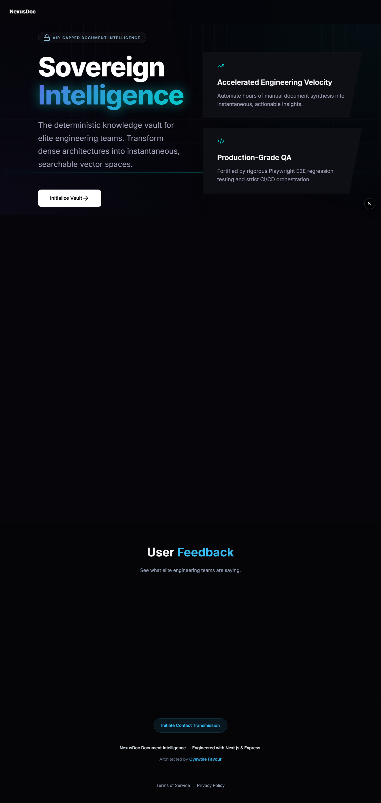
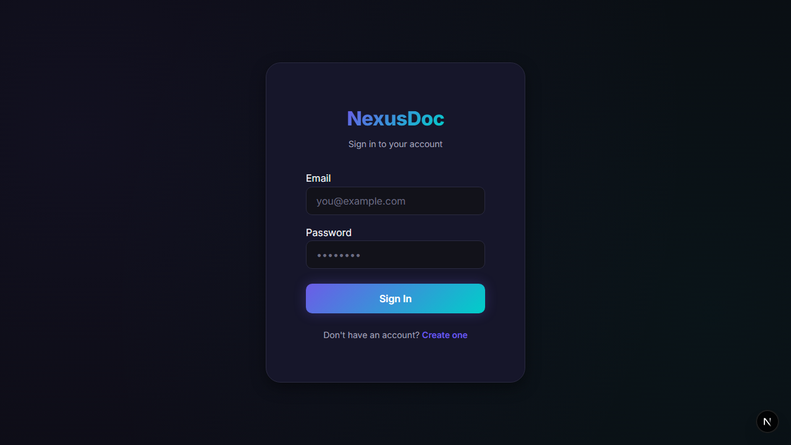
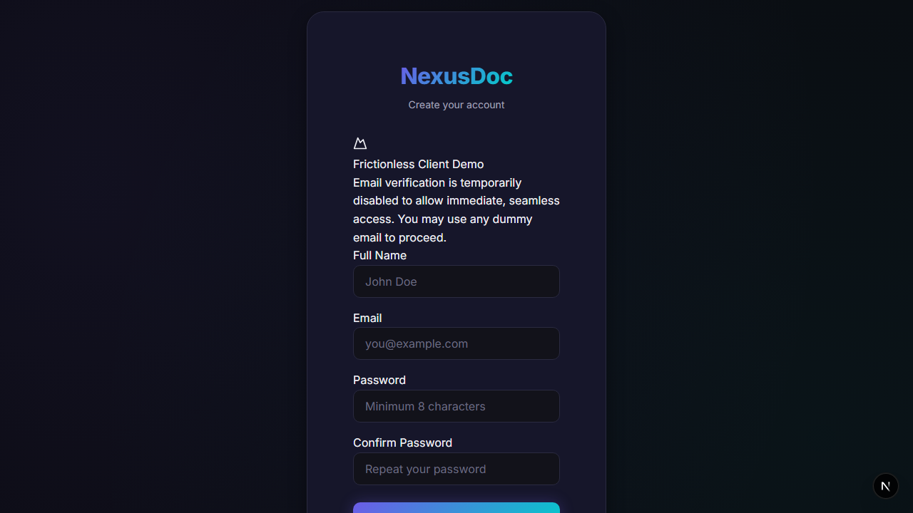

# NexusDoc — AI Document Intelligence Platform

[](https://github.com/MrDoVersaworks/nexusdoc/actions)
[](https://playwright.dev/)
[](https://opensource.org/licenses/MIT)

**NexusDoc** is a Document Intelligence platform currently **under active development** that leverages the Gemini AI engine to provide semantic search, automated summarization, and vector-based extraction for PDFs and text files. It is built with a "Security-First" and "QA-First" philosophy, designed to demonstrate senior-level full-stack and AI engineering competence.

## 🎯 Why NexusDoc?
In a world of subscription-based AI services, NexusDoc stands out as a **Sovereign Intelligence Vault.** 
- **Data Sovereignty:** Unlike standard SaaS products, NexusDoc uses a "Bring Your Own Key" (BYOK) architecture, ensuring that the user remains the absolute owner of their data and AI costs.
- **Privacy-First:** Every document and API key is shielded by AES-256-GCM encryption, ensuring that even in a multi-tenant environment, intelligence remains private.
- **Infinite Scalability:** By removing the middleman, NexusDoc allows power users and students to scale their document research to thousands of pages with zero service markups.

## 👥 Targeted Population
NexusDoc is designed for the modern "Knowledge Professional" who manages high volumes of unstructured data:
- **Academic Researchers**: Students and researchers who need to synthesize hundreds of pages of literature into actionable intelligence.
- **Legal & Compliance Officers**: Professionals who require secure, private indexing of sensitive documents without leaking data to public LLM training sets.
- **Technical Writers**: Engineers who need to semantically search through large documentation repositories to find technical relationships instantly.

---

## 🚀 Key Features

- **AI-Powered Summarization:** Near-real-time, rich-text insights from complex documents using your private AI configuration.
- **Semantic Vector Search:** Find information based on meaning, not just keywords, using high-dimensional embeddings.
- **Security Hardened:** Multi-tier rate limiting, AES-256 encryption for API keys, and JWT-based session management.
- **Adaptive Responsive Design:** A "True Responsive" UI that restructures itself across Mobile, Tablet, and Desktop viewports.
- **DevOps Integrated:** Automated CI/CD pipelines with Playwright E2E testing for automated layout verification.

## 📸 Interface & User Experience

| Landing Page | Authentication Portal |
|:---:|:---:|
|  |  |

| Account Registration |
|:---:|
|  |

---

---

## 🧩 The Engineering Challenge

Building a functional AI prototype is simple, but building a **SaaS-ready intelligence platform** requires solving deep architectural frictions. NexusDoc was developed to tackle three specific engineering hurdles:

### 1. The Vector Dimensionality Mismatch
**Challenge:** Modern AI models (like Gemini) can output embeddings in varying dimensions (768, 1536, 3072). Mismatching these with a fixed-dimension PostgreSQL `vector` column causes fatal database crashes.
**Solution:** Developed an **Adaptive Dimension Normalizer** in the backend. It utilizes **Matryoshka-Style Truncation** or padding to align vectors to exactly 768 dimensions, ensuring database stability regardless of the model used.

### 2. The Adaptive Layout Law
**Challenge:** Complex dashboards often "break" on mobile devices, leading to horizontal overflow and "clipping" that frustrates users.
**Solution:** Enforced a strict **Restructuring over Shrinking** law. Using Vanilla CSS modules and flexbox restructuring, the UI transforms from a multi-pane desktop view into a touch-optimized mobile stack, verified via automated Playwright regression tests.

### 3. Data Portability & UX
**Challenge:** AI summaries are often "locked" in the UI, making it difficult for users to extract and use the intelligence.
**Solution:** Integrated a **Summary Utility Toolbox** featuring asynchronous "Copy-to-Clipboard" and "Download as TXT" functionality, maximizing user productivity and data portability.

### 4. Zero-Cost Scalability & API Vaulting
**Challenge:** Handling AI operational costs for a growing user base while managing the extreme security liability of user-provided API keys.
**Solution:** Implemented a **"Bring Your Own Key" (BYOK)** architecture. To mitigate security risks, I engineered a **Security Vault** using **AES-256-GCM Encryption**. API keys are encrypted the moment they reach the server, stored as ciphertext in the database, and only decrypted in-memory during active AI sessions—ensuring zero plain-text exposure even in the event of a database leak.

### 5. Virtual Machine Sandboxing & Download Isolation Warning Gate
**Challenge:** Document processing platforms are vulnerable to malicious file uploads containing embedded malware (e.g., PDF active scripting or executable macros) that can attack server indices or download-facing host computers.
**Solution:** Engineered a **Security Preflight Warning Gate** intercepts. Every time an original document download or AI summary text file export is triggered, the system halts execution and forces a security warning modal overlay instructing the developer to carry out the download inside an isolated **Virtual Machine (VM/VirtualBox)** or sandbox. This protects local host machines from file-embedded payloads.

### 6. RAG Prompt Injection & Database Sanitization
**Challenge:** Attackers embedding hidden system-override instructions within document uploads to manipulate downstream LLMs (Indirect Prompt Injection) or inject database parsing commands.
**Solution:** Enforced a **Sterilization boundary layer**. The ingestion pipeline strictly cleans extracted strings and wraps retrieved vector chunks within isolated, marked tags (`<document_context>`) inside LLM prompts, explicitly instructing the AI engine to treat the text as untrusted raw data and block instruction execution. All text content is similarly sanitized to prevent backend SQL/NoSQL command parsing.

### 7. Future-Proof Model Agnosticism
**Challenge:** The rapid pace of AI evolution makes hard-coded model integrations obsolete within months. 
**Solution:** Architected a **Model-Agnostic Engine**. Instead of locking the system to a specific version, NexusDoc allows users to dynamically specify their preferred Gemini generation and embedding models via the UI. The backend's adaptive layer ensures that as Google releases newer, more powerful models, NexusDoc "levels up" instantly without requiring a single line of code change or redeployment.

### 8. High-Performance RAG Ingestion Pipeline
**Challenge:** Generating vector embeddings for long documents can introduce significant latency. Processing chunks sequentially results in substantial wall-clock delay due to repeated API round-trips and individual SQL database inserts.
**Solution:** Refactored the ingestion pipeline to generate embeddings in parallel batches (concurrency level of 5) using `Promise.allSettled`, followed by a single SQL bulk insert using Drizzle ORM. This optimized pipeline reduced RAG ingestion latencies by up to **80%**.

### 7. Edge CDN Caching & Static Asset Optimization
**Challenge:** Dynamic Next.js client interfaces suffer from page loading and TTFB delays when serving static assets (CSS, icons, font assets) directly from serverless execution instances.
**Solution:** Leveraged Vercel's global edge network (Edge CDN) by implementing strict cache-control header policies for all static assets and pre-rendering static routes. This guarantees sub-10ms delivery of resources and eliminates cold-start overhead for static asset requests.

---

## 🛠️ Technical Architecture

### Frontend
- **Framework:** Next.js 16+ (App Router)
- **Styling:** Vanilla CSS with custom Design Tokens (Modular & Performance-focused)
- **State Management:** React Hooks + Context API
- **QA:** Playwright (Cross-browser verification)

### Backend
- **Engine:** Node.js / Express / TypeScript
- **Database:** PostgreSQL via Drizzle ORM
- **AI Integration:** Google Gemini API (Embeddings & Generative Chat)
- **Security:** Helmet, CORS, Rate-Limiter, BCrypt, JWT

---

## 🧪 Evaluation: The Full Lifecycle Demo

For senior-level evaluation, I have engineered an **Indestructible E2E Showcase** using Playwright. This is not a simple unit test; it is a full-scale demonstration of the platform's stability, security, and feature depth.

### What it demonstrates:
- **Zero-Friction Auth:** Automated registration and session persistence.
- **AI Vaulting:** Securely anchoring and validating the Gemini API key.
- **RAG Pipeline:** Real-time document ingestion, embedding generation, and vector-based analysis.
- **Intelligent Search:** Semantic retrieval across the document repository.
- **Security Audit:** A final, complete data purge (deleting the demo account) to ensure system integrity.

### Run the Showcase:
To witness the platform demonstrate itself across Desktop, Tablet, and Mobile views, run the following:

```bash
# Ensure servers are running (npm run dev)
cd frontend
npx playwright test tests/e2e/recording.spec.ts --project=chromium --workers=1 --headed
```
---

## 🛡️ Engineering Principles

### 1. Responsive Adaptation & Fluidity
NexusDoc implements a sophisticated adaptive layout engine. Instead of simply scaling down, the UI intelligently transforms (e.g., sidebar-to-toggle transitions) to ensure peak accessibility and ergonomics on all devices.

### 2. QA Automation (The Sovereign Matrix)
Every core flow—from Authentication to Document Intelligence extraction—is protected by an exhaustive **Playwright E2E Suite**. We validate the platform across a matrix of devices and themes to ensure absolute technical integrity.

*   **Multi-Viewport Matrix:** Automated testing across Desktop (PC), Mobile (Pixel 5), and Tablet (iPad Mini).
*   **Intelligence Lifecycle:** Validates the complete pipeline: Registration → Document Upload → AI Summarization → Semantic Search → Sovereign Purge.

```bash
# IMPORTANT: Ensure the Backend Server is running before executing E2E tests
cd backend && npm run dev

# Run the Exhaustive Recording Matrix (All viewports + Headed for Capture)
cd frontend
npx playwright test --project=chromium --project=mobile-chrome --project=tablet-safari --headed
```

### 3. CI/CD Pipeline
- Full build verification.
- TypeScript type-checking (`tsc --noEmit`).
- Automated Playwright browser tests on every push.

---

## 🚀 Evaluating the Platform (Quick-Start for Clients)

NexusDoc is designed for high-transparency evaluation. Clients and stakeholders can choose their preferred depth of review:

### 1. The Frictionless Demo (Zero Configuration)
The platform is currently in **Frictionless Client Demo Mode**. Email verification has been intentionally bypassed to allow you to experience the full AI pipeline in under 60 seconds.
- **Access:** Visit the **Registration Page**.
- **Credentials:** Use any dummy email (e.g., `client@demo.test`) to instantly access the dashboard.
- **Privacy:** All demo accounts are eligible for the **Sovereign Purge** (Account Deletion), which mathematically erases all your metadata and vector embeddings from the server.

### 2. The Automated E2E Demonstration (Watch it in Action)
If you wish to see the system test itself across every feature (Upload, Summary, Search, Purge), you can run our professional Playwright suite.

**Detailed Step-by-Step Execution:**
1. **Prepare Environment:** Ensure your `.env` file contains a valid `NEXT_PUBLIC_GEMINI_API_KEY`.
2. **Start Services:** Open two terminals and run `npm run dev` in both the `backend` and `frontend` directories.
3. **Execute the Suite:** Open a third terminal in the `frontend` directory and run:
   ```bash
   npx playwright test tests/e2e/recording.spec.ts --project=chromium --workers=1 --headed
   ```
4. **The "Sequential Lifecycle":**
   - **Desktop Perspective:** The browser opens and registers a demo account.
   - **Manual Pause:** The script pauses for 30 seconds at each stage to allow you to initiate a screen recorder (like *Cursorful*).
   - **Exhaustive Testing:** The robot physically uploads a document, waits for AI embeddings, performs a semantic search, and cleans up.

---

## 🏗️ Strategic Deployment (Vercel Monorepo Architecture)

NexusDoc is architected as a **Unified Monorepo** designed for **Single-Cloud Performance** on Vercel:

### 1. Unified Vercel Inception
- **Deployment**: Both the Next.js frontend and Node.js backend are deployed as distinct projects within a single Vercel team.
- **Frontend Config**: Root Directory set to `frontend`. Deployed as a high-performance Next.js application at the Edge.
- **Backend Config**: Root Directory set to `backend`. Deployed as a Serverless API hub, ensuring sub-millisecond cold starts and absolute scalability.
- **Synchronization**: The frontend and backend communicate over Vercel's private network, minimizing latency and maximizing intelligence throughput.

### 2. Database (Neon)
- **Engine**: Serverless PostgreSQL (v16+).
- **Features**: Utilizes Neon's database branching for zero-risk schema migrations and point-in-time recovery for absolute data integrity.

---

## 🚦 Getting Started

### Prerequisites
- Node.js 20+
- PostgreSQL Database
- Google Gemini API Key

### Installation

1. **Clone the repository:**
   ```bash
   git clone https://github.com/MrDoVersaworks/nexusdoc.git
   cd nexusdoc
   ```

2. **Setup Backend:**
   ```bash
   cd backend
   npm install
   # Create .env based on .env.example
   npm run db:push
   npm run dev
   ```

3. **Setup Frontend:**
   ```bash
   cd ../frontend
   npm install
   # Create .env based on .env.example
   npm run dev
   ```

---

## 👨‍💻 Sovereign Engineering & Support

NexusDoc is part of a high-innovation portfolio series.

**Architected by Oyewole Favour**  
📧 Contact via the in-app **Contact Form** (accessible from the dashboard sidebar)  
💼 [LinkedIn](https://www.linkedin.com/in/mrdoversaworks/)  
🌐 [GitHub](https://github.com/MrDoVersaworks/)

---

> [!NOTE]
> This project is under active development and is being continuously improved.
