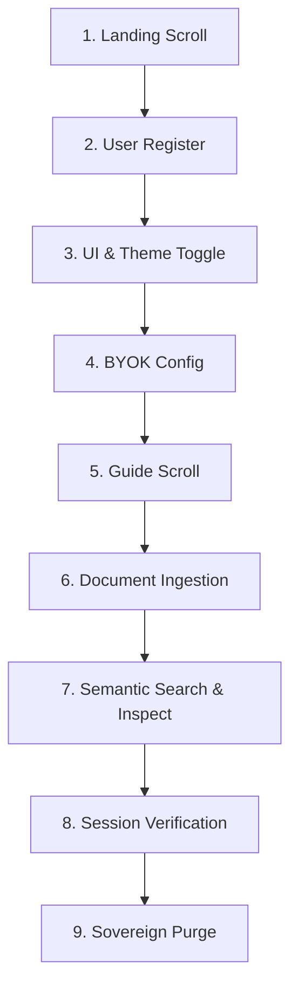

# 📄 NexusDoc Sovereign E2E Recording Walkthrough

This document serves as the high-fidelity technical documentation for the **Sovereign E2E Demo Engine** built for **NexusDoc**. It outlines the exact sequence, the browser APIs leveraged by Playwright, and the architectural rationale behind each transition gate.

---

## 🏗️ The E2E Architectural Matrix

The test suite in [recording.spec.ts](./recording.spec.ts) runs at a deliberate, human-like pace to guarantee high-definition recording clarity. It acts as an automated "Director's Cut," showcasing premium frontend aesthetics, semantic search capability, and secure backend endpoints.



---

## 📝 Detailed 9-Stage Demo Sequence

### 1. Landing Page Scroll & Verification
* **Objective:** Showcase the responsive design, landing grids, and the core brand theme.
* **Mechanism:** Verifies key landing page copy `"Sovereign Intelligence"`, scrolls the page smoothly to demonstrate layout stability, and returns to the top.

### 2. Identity Registration
* **Objective:** Establish the workspace owner credentials.
* **Payload:** Generates unique `demo_${timestamp}_desktop@nexus.test` credentials.

### 3. Sidebar & Theme Transitions
* **Objective:** Verify fluid layout reactivity and transition states.
* **Actions:**
  1. Interacts with the **Sidebar Toggle** (`#sidebar-toggle`) to expand/collapse the navigation portal.
  2. Toggles between the **Sovereign Dark** and **Technical Light** themes to demonstrate instant CSS variables switching with zero flicker.

### 4. AI & Embedding Configuration (BYOK)
* **Objective:** Anchor custom LLM parameters and API credentials.
* **Actions:**
  1. Navigates to `/settings`.
  2. Populates the API key with the secure `SYSTEM_API_KEY`.
  3. Sets the generation model to `gemini-2.5-flash` and the embedding model to `gemini-embedding-001` (demonstrating model-agnostic flexibility).
  4. Saves configuration to the database.

### 5. Guide Exploration
* **Objective:** Expose the user onboarding workflow.
* **Action:** Accesses `/guide` and triggers a full-page smooth scroll to showcase the documentation.

### 6. Document Ingestion
* **Objective:** Verify secure document uploading and vector chunking.
* **Actions:**
  1. Opens the `/documents` portal.
  2. Programmatically creates a local `sample.txt` with sample text: 
     > *"Sovereign AI Protocol: Deterministic execution is the baseline for senior engineering. The system must remain 100% original..."*
  3. Uses Playwright's `setInputFiles` API to upload the file.
  4. Clicks upload and waits for the confirmation toast: `"Document uploaded successfully!"` (waits for processing to complete).

### 7. Semantic Search & AI Summary Inspection
* **Objective:** Verify real-time embedding matching and vector extraction.
* **Actions:**
  1. Navigates to `/search`.
  2. Searches for `"Sovereign Engineering"`.
  3. Clicks on the search result card `"Sovereign Engineering Standard"`.
  4. Opens the document view, tests **Copy to Clipboard** and **Download Text**, and expands **View AI Raw Extraction** to verify the raw parsed vectors.

### 8. Explicit Logout & Login Verification
* **Objective:** Verify session token clearing and database session validation.
* **Actions:**
  1. Logs the user out.
  2. Returns to `/login` and re-authenticates to prove the session persisted correctly.

### 9. Multi-Gate Sovereign Purge
* **Objective:** Showcase absolute data privacy and sovereign security gates.
* **Actions:**
  1. Navigates to `/settings`.
  2. **Purges the API Key:** Deletes the key and confirms.
  3. **Purges the Profile:** Clicks **Initiate Sovereign Purge**, inputs the password, and confirms account deletion.
  4. Redirects to `/login` with a clean backend state.

---

> [!IMPORTANT]
> **API Key Safety:** The E2E script retrieves the `GEMINI_API_KEY` dynamically from the local backend env file without ever exposing it in plain text to the public repository or logs.

> [!TIP]
> **Headed Recording:** To record a video demo with a visible browser window, run:
> ```bash
> cd frontend
> HEADED=1 npx playwright test
> ```
> On Windows PowerShell:
> ```powershell
> cd frontend
> $env:HEADED=1; npx playwright test
> ```
